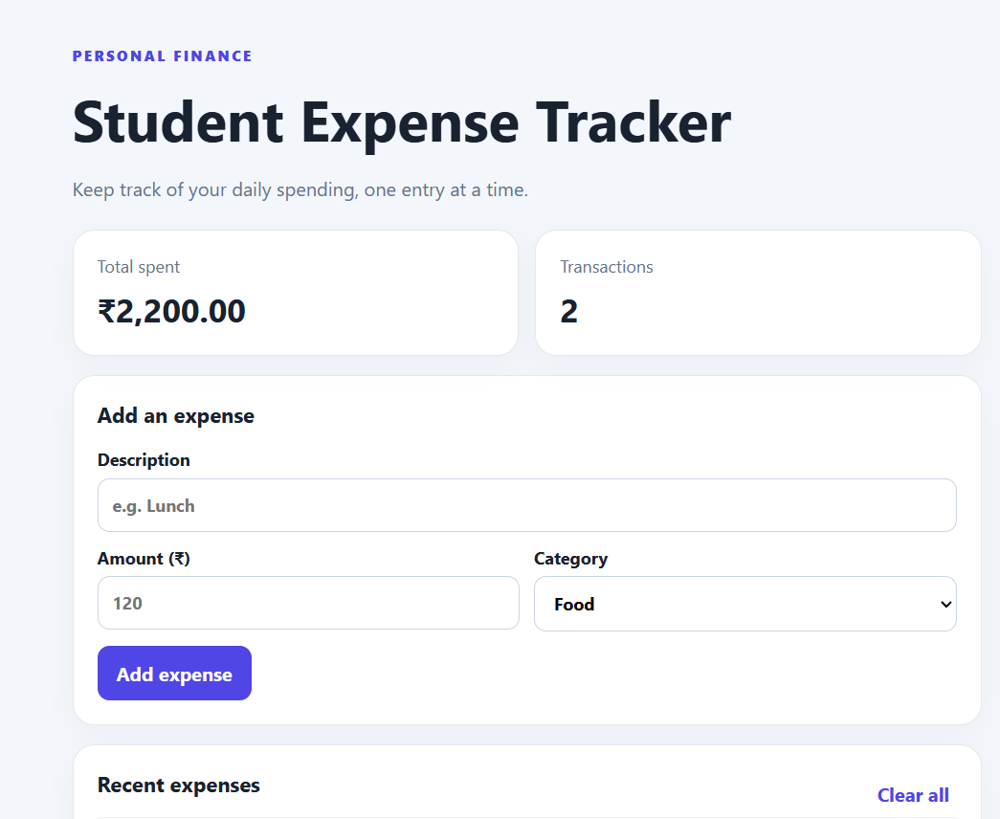

💸 Student Expense Tracker

A simple, beginner-friendly web application that helps students track their daily expenses, manage spending, and stay aware of where their money goes.

📸 Project Preview



🔗 **Live Demo:** [View Student Expense Tracker](https://surbhiag1.github.io/student-expense-tracker/)

✨ Features

* ➕ Add expenses with a description, amount, and category.
* 📋 View your recorded expenses in one place.
* 🗑️ Delete expenses when needed.
* 💾 Save expense records using browser `localStorage`.
* 📱 Simple and clean interface for everyday use.

🛠️ Built With

* **HTML5** — Page structure
* **CSS3** — Styling and layout
* **JavaScript** — Application logic and interactivity
* **LocalStorage** — Saving expense data in the browser

🚀 Getting Started
 Run Locally

1. Clone this repository:

   ```bash
   git clone https://github.com/surbhiag1/student-expense-tracker.git
   ```

2. Open the project folder.

3. Open `index.html` in your browser.

No additional installation is required.

 📂 Project Structure

```text
student-expense-tracker/
├── index.html
├── style.css
├── script.js
└── README.md
```

🎯 Learning Outcomes

Through this project, I practised:

* Structuring web pages with HTML.
* Styling interfaces using CSS.
* Handling user interactions with JavaScript.
* Working with browser LocalStorage.
* Publishing a static website using GitHub Pages.

 🔮 Future Improvements

* Add monthly expense summaries.
* Display spending charts and statistics.
* Add expense filtering by category.
* Improve mobile responsiveness.
* Add budget limits and spending alerts.

👩‍💻 Author
**Surbhi Agarwal**
Computer Science Engineering Student | Aspiring Software Developer
* GitHub: [@surbhiag1](https://github.com/surbhiag1)
* LinkedIn:https://www.linkedin.com/in/surbhi-agarwal-70286a371?utm_source=share_via&utm_content=profile&utm_medium=member_android

⭐ If you find this project useful, consider giving the repository a star!
